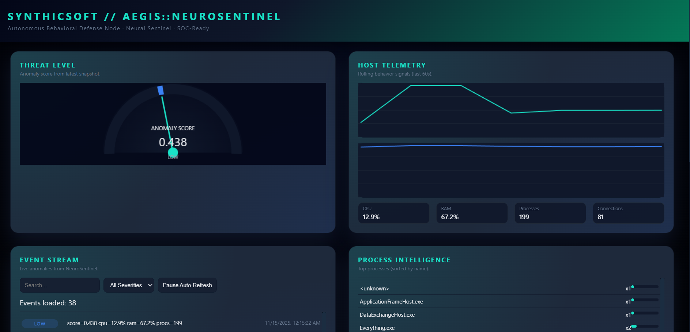
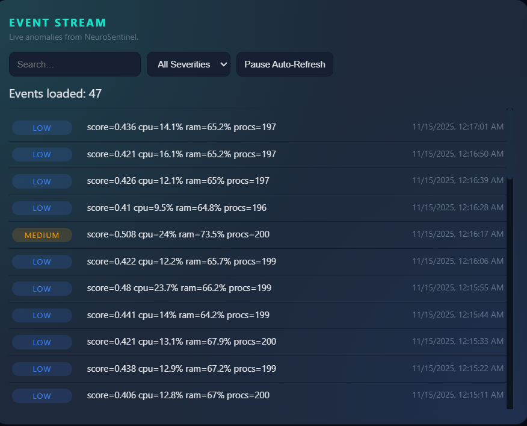
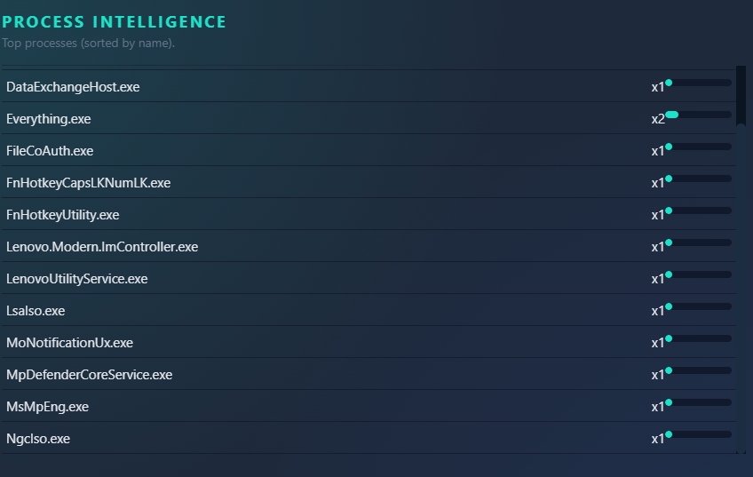
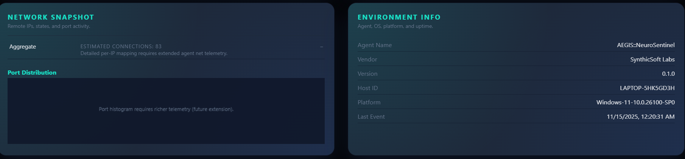

# 🧠 AEGIS::NeuroSentinel
### SynthicSoft Labs – Autonomous Neural SOC Agent / Sentinel / Behavioral Watchdog  
**Part of the Suntincerl Security Suite**



## 📡 Overview
**AEGIS::NeuroSentinel** is a cross-platform, neural-powered cybersecurity sentinel that monitors host behavior, generates high-value security telemetry, and emits structured anomaly events for SIEMs, dashboards, and automations.

It is fully local-first, autonomous, and self-contained, requiring zero cloud dependencies.

Designed with the SynthicSoft Cyber Command Interface aesthetic, NeuroSentinel is engineered for real-world SOC operations, behavioral analysis, and threat hunting.



## 🎯 Key Capabilities
### 🔍 Behavioral Telemetry Collection
- CPU utilization patterns  
- Memory pressure  
- Process churn & suspicious executions  
- Network connection activity  
- Endpoint environment metadata  

### 🧠 Neural Anomaly Scoring Engine
A pluggable anomaly scorer that:
- Assigns a score between **0.0 – 1.0**
- Maps to SynthicSoft severity levels (INFO → CRITICAL)
- Uses a modular ML-ready interface

### 📤 Event Generation & SIEM Integration
NeuroSentinel produces structured **NDJSON events** containing:
- Telemetry snapshot  
- Score & severity  
- Host fingerprint  
- Behavioral indicators  

Compatible with Splunk, Elastic, Graylog, Wazuh, etc.

### 🌐 HTTP API for Dashboards
FastAPI microservice exposes:
- `/api/events/latest`
- `/api/health`

### 🖥 SynthicSoft Cyber Command Dashboard
Includes threat gauge, telemetry graphs, event stream, process intelligence, network snapshot, environment panel.



## 📂 Repository Structure
```
AEGIS-NeuroSentinel/
├── agent/
│   ├── neuro_sentinel.py
│   ├── model.py
│   ├── config.yaml
│   ├── event_schema.json
│   └── outputs/events.ndjson
├── api/server.py
├── dashboard/index.html
└── README.md
```

## ⚙ Installation
```
pip install psutil pyyaml fastapi uvicorn
```
Run agent:
```
cd agent
python neuro_sentinel.py
```
Run API:
```
cd api
uvicorn server:app --reload --port 8080
```

## 📊 Event Format
Each event is JSON on a new line:
```json
{
  "event_id": "...",
  "timestamp": "...",
  "agent": {
    "name": "AEGIS::NeuroSentinel",
    "vendor": "SynthicSoft Labs",
    "version": "0.1.0",
    "host_id": "MY-PC",
    "platform": "Windows-11"
  },
  "classification": {
    "type": "behavioral_anomaly",
    "severity": "high",
    "score": 0.743
  },
  "snapshot": {
    "cpu_percent": 71.3,
    "ram_percent": 84.9,
    "process_count": 143,
    "net_connection_count": 52,
    "top_processes": ["python.exe","svchost.exe"]
  }
}
```

## 🌐 API Endpoints
- `/api/events/latest?limit=100`
- `/api/health`

## 🧭 Dashboard Panels
- Threat Gauge  
- Telemetry Graphs  
- Event Stream  
- Process Intelligence  
- Network Snapshot  
- Environment Panel  



## 🎨 Brand Identity
- SynthicSoft Cyan: #19E3C8  
- Midnight Base: #0F172A  
- Steel Slate: #1E293B  
- Graphene Gray: #64748B  
- Inter + JetBrains Mono  

## 📜 License
MIT License – © SynthicSoft Labs
